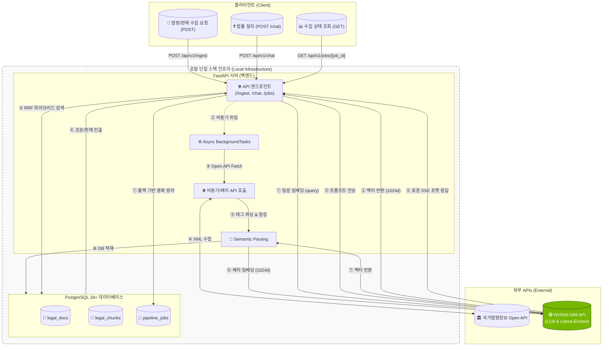

![[../image/01. 국가법령정보 Open API 활용 재산범죄 법률 RAG 시스템 구축 프로젝트.png]]

## 1. 개요 및 프로젝트 목표 (Executive Summary)

### 1.1 프로젝트 목적

본 프로젝트는 국가법령정보 공동활용 [Open API(open.law.go.kr)](https://open.law.go.kr)를 활용하여 현행 법령 및 판례 데이터를 수집·구조화하고, 로컬 환경의 PostgreSQL 18+(pgvector)과 NVIDIA Nemotron Ultra (NIM API)를 결합하여 "사기·재산범죄 피해 대응 RAG 시스템(Legal RAG)"을 구축하는 것을 목표로 합니다.

초기 데이터 스코프를 '형법 제347조(사기) 등 재산범죄 관련 법령 조문 및 대법원 주요 판례 50~100건'으로 명확히 한정하여 로컬 환경에서 완성도를 높이고, 단순 법령 나열을 넘어 ① 관련 법령 해설, ② 유사 판례 요약, ③ 피해자 조치 절차(Action Plan)를 3단계 구조로 제공합니다.

```
+-----------------------------------------------------------------------------+
|               NVIDIA Nemotron + PostgreSQL Legal RAG 시스템                 |
|                                                                             |
|  +--------------------+                       +--------------------------+  |
|  |   FastAPI Server   |                       |  Local PostgreSQL 18+    |  |
|  |                    | ---- (SQL Query) ---> |                          |  |
|  | - Open API Fetch   |                       | - legal_docs (법령/판례) |  |
|  | - XML/JSON Parsing |                       | - legal_chunks (조문/판례)| |
|  | - Async Background | <--- (Data Rows) ---- | - pipeline_jobs (상태)   |  |
|  +--------------------+                       +--------------------------+  |
|           | (OpenAI SDK / NIM API 연동)                                     |
|           v                                                                 |
|  [ NVIDIA NIM API (Nemotron Ultra) ] <- 최고 수준의 법률 문맥 추론 및 답변  |
+-----------------------------------------------------------------------------+
```

### 1.2 핵심 목표 및 성능 지표 (Key Metrics)

- **구조화된 데이터 파이프라인**: Open API의 XML 구조(`조문단위`, `판시사항`, `판결요지`)를 활용한 의미 단위 Semantic Chunking 구현.
    
- **한국어 다국어 임베딩 & MRL 차원 최적화**: 한국어를 지원하는 `nvidia/llama-3.2-nv-embedqa-1b-v2` 모델을 채택. API 공식 지원 규격인 1024차원(MRL)으로 축소하여 기본 2048차원 대비 메모리를 50% 절감.
    
- **RRF 기반 하이브리드 검색**: `pgvector` 코사인 유사도 검색과 `GIN`(`word_similarity` 기반 Trigram) 검색을 **RRF(Reciprocal Rank Fusion)** 알고리즘으로 결합. 5만 건 더미 데이터 적재 환경에서 DB 검색 지연시간 $Latency < 100ms$ (p95 기준 실측) 달성.
    

---

## 2. 전체 시스템 아키텍처 (System Architecture)




---

## 3. 6주 단계별 개발 로드맵 (Local PoC → Async API)

학습 단계에 맞춰 로컬 환경(PostgreSQL 18+ 직접 설치)에서 기초부터 차근차근 검증하며 쌓아 올립니다. 목표 데이터는 "사기/재산범죄 법령 및 판례 50~100건"입니다.

|**주차**|**주요 목표**|**상세 작업 내용**|
|---|---|---|
|**1주차**|**로컬 DB & 동기식 수집 스크립트 작성**|로컬에 PostgreSQL 18+ 및 `pgvector` 네이티브 설치.Open API에서 형법 347조 등 XML 데이터를 수동 스크립트로 파싱 테스트.|
|**2주차**|**DB 스키마 구성 & 임베딩 적재**|`legal_docs`, `legal_chunks` 테이블 생성.`nvidia/llama-3.2-nv-embedqa-1b-v2` 모델(1024차원)을 활용한 임베딩 생성 및 로컬 DB 적재.|
|**3주차**|**하이브리드 검색(RRF) 로컬 쿼리 검증**|DBeaver 등 툴을 활용해 `pg_trgm`의 `word_similarity` 연산자(`< %`) 및 RRF 쿼리 결합 테스트 진행.|
|**4주차**|**FastAPI 비동기 전환 & 예외 처리**|`pipeline_jobs` 스키마 설계 및 부분 유니크 인덱스 생성.FastAPI `BackgroundTasks` 적용, `IntegrityError` 롤백 방어 및 `tenacity` 재시도 구현.|
|**5주차**|**LLM 프롬프트 & SSE API 구현**|`POST /api/v1/chat` 엔드포인트 구현.Nemotron 3 Ultra 연동, 3단 구조 프롬프트 적용 및 표준 `data: {}\n\n` SSE 스트리밍 테스트.|
|**6주차**|**트러블슈팅 정리 및 포트폴리오화**|더미 데이터 5만 건 적재 후 `EXPLAIN ANALYZE` 로 레이턴시 측정.GPT-4o-mini vs Nemotron 출력 비교 표 작성. GitHub 리드미 및 트러블슈팅 로그 정리.|

---

## 4. 데이터 구조적 수집 및 파이프라인 명세

국가법령정보 공동활용 사이트에서 제공하는 Open API 데이터 중, 사기·재산범죄 피해 대응 RAG 시스템 구축에 필수적인 데이터 목록과 수집-적재-활용 파이프라인입니다.

### 4.1 RAG 파이프라인 데이터 분류 종합표

|**분류**|**Open API 서비스명**|**대상 범위 (조문 / 사건)**|**주요 수집 데이터 필드 (XML/JSON)**|**RAG 활용 목적 및 역할**|
|---|---|---|---|---|
|**법령 (STATUTE)**|**법령 본문 Open API** (`SearchLawService`)|• 형법 (제347조, 제347조의2, 제355조 등)• 특정경제범죄 가중처벌법• 전기통신금융사기피해환급법|`법령ID`, `법령명`, `시행일자`, `조문번호`, `조문내용`, `항내용`, `호내용`|**[1단계] 적용 법령 및 법정형 인출**• 범죄 구성요건 및 처벌 수위 정확도 확보|
|**판례 (PRECEDENT)**|**판례 본문 Open API** (`SearchPrecService`)|• 사기·횡령·배임·보이스피싱 관련 대법원/하급심 주요 판례 (50~100건)|`판례정보일련번호`, `사건명`, `사건번호`, `선고일자`, `판시사항`, `판결요지`, `참조조문`, `전문`|**[2단계] 유사 판례 및 성립 요건 요약**• 기망행위, 편취 범의 등 법적 쟁점 판단|
|**절차 (ACTION PLAN)**|**법령 본문 API** & **별표·서식 Open API**|• 소송촉진 등에 관한 특례법 (배상명령)• 민사집행법 (지급명령)• 범죄피해자보호법 및 관련 양식|`조문내용` (배상명령/지급명령 신청 절차), `서식명`, `서식파일URL`|**[3단계] 피해자 실질 조치 절차 안내**• 형사 고소, 계좌 지급정지, 민사/배상명령 절차 안내|

### 4.2 필수 데이터 세트 매핑 및 활용 근거

|**데이터 세트**|**시스템 내 역할 및 기여도**|**3단계 구조 매핑**|
|---|---|---|
|**DB 1 (법령)**|형법(사기죄, 횡령죄 등), 특경법, 통신사기피해환급법 등의 **기본 구성요건과 법정형(형량)**을 제공합니다.|**[1단계] 적용 법령 및 형량**|
|**DB 19 (법원 판례)**|대법원 판례의 **판시사항 및 판결요지**를 제공하여, 실제 재판에서 기망행위나 편취 범의 등이 어떻게 인정되는지 구체적인 판단 기준을 제시합니다.|**[2단계] 유사 판례 요약**|
|**DB 11 (별표·서식)**|범죄 피해 발생 시 실무적으로 필요한 **지급정지 신청서, 배상명령 신청서, 각종 신고·구제 서식 및 절차 관련 별표 정보**를 담고 있어 피해자 구제 액션 플랜의 신뢰성을 높여줍니다.|**[3단계] 피해자 조치 절차**|

### 4.3 수집 - 적재 - 활용 파이프라인 메커니즘

- **데이터 수집 구간 (Ingestion)**: 외부 Open API(DB 1, DB 11, DB 19)를 비동기 방식으로 호출하여 XML 원본 데이터를 취득하고 의미 단위로 파싱합니다.
    
- **데이터 적재 구간 (Loading & Storage)**:
    
    - 메타데이터 테이블(`legal_docs`)에 상위 문서 정보(법령명, 선고일자 등)를 저장합니다.
        
    - 청크 및 벡터 테이블(`legal_chunks`)에 쪼개진 텍스트를 담고, **NVIDIA NIM API**를 통해 1024차원 임베딩 벡터로 변환하여 외래키 연동과 함께 저장합니다.
        
- **데이터 활용 구간 (Retrieval & RAG)**: 질의 발생 시 RRF 하이브리드 검색을 통해 최적의 청크(`legal_chunks`)를 인출하고, 외래키를 통해 원본 문서(`legal_docs`)의 메타데이터 및 서식 정보(DB 11)를 결합하여 Nemotron 3 Ultra 모델을 통해 3단계 구조의 답변을 스트리밍 출력합니다.
    

---

## 5. 인프라 요구 사양 및 로컬 개발 환경 분석

### 5.1 타겟 로컬 시스템 스펙

- **CPU**: AMD Ryzen 7 5800H (8코어 16스레드)
- **GPU**: NVIDIA GeForce RTX 3070 Laptop (VRAM 8GB)
- **RAM**: 32GB

### 5.2 하드웨어 리소스 적합성 평가 (보유 스펙 기준)

본 프로젝트는 무거운 LLM(대형 언어 모델)이나 임베딩 모델을 로컬 GPU/CPU에 직접 띄우지 않고, **모두 클라우드 기반의 NVIDIA NIM API를 호출하여 활용하는 아키텍처**로 설계되어 있습니다.

따라서 사용자의 로컬 하드웨어 스펙(`Ryzen 7 5800H`, `RTX 3070 8GB`, `RAM 32GB`)은 **로컬 단일 스택 개발 및 대규모 더미 데이터 검증에 차고 넘치는 훌륭한 환경**입니다.

| **컴포넌트**                                      | **연산 주체**             | **하드웨어 의존성**            | **보유 스펙(5800H / RTX 3070 8GB / RAM 32GB) 적합성** |
| --------------------------------------------- | --------------------- | ----------------------- | ---------------------------------------------- |
| **LLM 추론<br>(Nemotron Ultra)**                | 클라우드 API (NVIDIA NIM) | 클라우드 처리 (로컬 VRAM 부담 0%) | 🟢 **완벽 호환**                                   |
| **임베딩 변환<br>(Llama-Embed)**                   | 클라우드 API (NVIDIA NIM) | API 통신형태로 처리            | 🟢 **완벽 호환**                                   |
| **데이터베이스 및 검색<br>(PostgreSQL 18 + pgvector)** | 로컬 시스템                | RAM 및 NVMe 디스크 I/O 중심   | 🟢 **최적 환경**<br>(RAM 32GB로 넉넉한 버퍼 캐시 확보 가능)    |
| **백엔드 서버<br>(FastAPI / Async Tasks)**         | 로컬 CPU                | 8코어 16스레드 멀티스레딩         | 🟢 **원활함**<br>(비동기 I/O 및 백그라운드 태스크 처리 최적)      |

### 5.3 로컬 개발 최적화 가이드라인

1. **PostgreSQL 메모리 튜닝**: 32GB의 넉넉한 RAM 환경을 활용하여 `shared_buffers`를 전체 RAM의 25%(약 8GB)로 설정하고, HNSW 벡터 인덱스 빌드 시 `maintenance_work_mem`을 2~4GB로 넉넉히 할당하면, 5만 건 이상의 대량 더미 데이터 적재 환경에서도 $p95$ 기준 $Latency < 100ms$ 성능 지표를 안정적으로 검증할 수 있습니다.
    
2. **네트워크 및 전력 관리**: 노트북 환경이므로 장시간 대량 데이터 수집(Ingest) 시 발열과 스로틀링을 방지하기 위해 고성능 모드 전원 설정을 유지하고 안정적인 네트워크 연결 환경에서 테스트를 수행하는 것을 권장합니다.