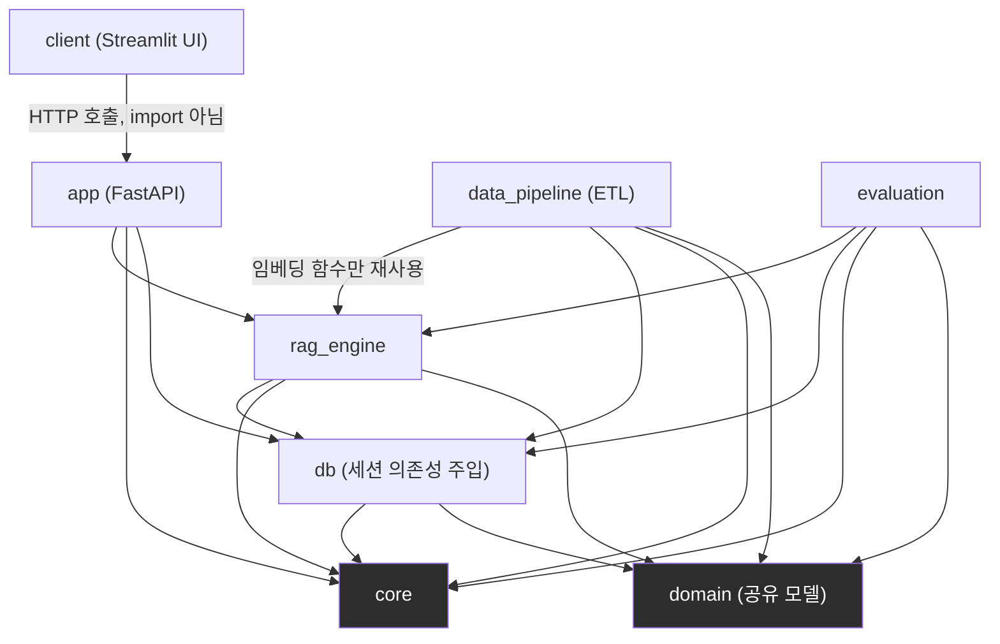
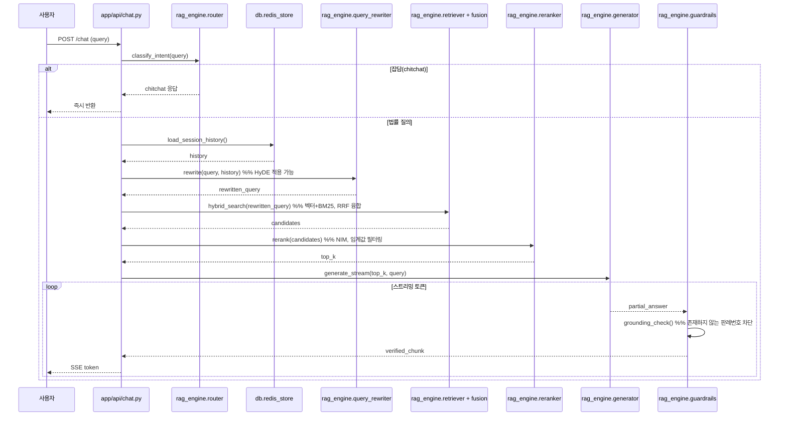

# Legal RAG 시스템 아키텍처 명세서 (v2.0 — 최종안)

> 대상 프로젝트: 사기·재산범죄 피해 대응 RAG 시스템 (TP01)
> 목적: 단일 책임 원칙(SRP) 및 관심사 분리(SoC)를 적용한 실무 수준 모듈화 재구성
> 이전 버전 대비 변경점: 계층 간 의존성 규칙 명문화, 공유 도메인 모델 계층 신설, 설정 관리 전략 구체화, 테스트 구조 추가

---

## 1. 개요 및 리팩토링 목표

기존 코드베이스는 `before_processing/`, `src/` 등에 데이터 수집·가공 스크립트가 파편화되어 있고, 버전별로 남겨진 평가 스크립트(v2~v6)와 일회성 패치 스크립트(`patch_*.py`)가 혼재되어 있었다. 본 명세서는 다음 세 가지 목표로 재구성한다.

1. **파편화된 파일 통합**: 흩어진 데이터 수집/가공 스크립트를 단일 ETL 파이프라인(`data_pipeline/`)으로 통합
2. **레거시/일회성 코드 제거**: 버전별 평가 스크립트, 패치 스크립트 삭제
3. **관심사 분리(SoC) + 의존성 방향 고정**: API, RAG 코어, 데이터 파이프라인, 평가 계층을 분리하되 — 계층을 나누는 것만으로는 SoC가 완성되지 않으므로, **어떤 계층이 어떤 계층을 참조할 수 있는지를 규칙으로 못박아 순환 참조를 원천 차단**한다.

---

## 2. 시스템 아키텍처 (레이어 다이어그램)

레이어 분리의 핵심은 "폴더 나누기"가 아니라 **의존성 방향**이다. 아래 다이어그램은 각 모듈이 참조할 수 있는 방향을 화살표로 고정한 것이다. `core`와 `domain`이 최하위 계층(리프 노드)이며, 상위 계층은 하위 계층만 참조할 수 있고 그 역방향은 금지된다.



**읽는 법**: 화살표 방향으로만 import가 허용된다. 예를 들어 `rag_engine`은 `data_pipeline`을 import할 수 없다 (화살표가 없음). 이 규칙이 깨지면 순환 참조가 생기고, 그 순간부터 "관심사가 분리되어 있다"는 주장은 성립하지 않는다.

---

## 3. 의존성 규칙 (명문화)

| 모듈 | Import 허용 | Import 금지 | 비고 |
|---|---|---|---|
| `client` | — (없음) | 모든 백엔드 모듈 | `app`을 **HTTP로만** 호출. 직접 import 시 API 계층 우회 → SoC 붕괴 |
| `app` | `rag_engine`, `core`, `domain`, `db`(의존성 주입 목적) | `data_pipeline`, `evaluation` | API 계층은 파이프라인/평가 로직을 몰라야 함 |
| `rag_engine` | `db`, `core`, `domain` | `app`, `data_pipeline`, `evaluation`, `client` | RAG 코어는 자신을 호출하는 대상을 몰라야 함 |
| `data_pipeline` | `rag_engine`(임베딩 함수 한정), `db`, `core`, `domain` | `app`, `evaluation`, `client` | 임베딩 로직 재사용 외 `rag_engine` 세부 구현에 의존 금지 |
| `evaluation` | `rag_engine`, `db`, `core`, `domain` | `app`, `data_pipeline`, `client` | 평가는 RAG 파이프라인을 블랙박스로 호출 |
| `db` | `core`, `domain` | 그 외 전체 | 순수 연결 관리 계층 |
| `core` | — (없음) | 전체 | 순수 유틸리티, 외부 의존 없음 |
| `domain` | — (없음) | 전체 | 순수 데이터 모델(Pydantic), 로직 없음 |
| `tests/*` | 전체 | — | 테스트 목적 예외 |

> **CI 강제화 권장**: 이 규칙은 문서로만 두면 시간이 지나며 깨진다. `import-linter` 또는 `pydeps` 같은 도구로 `pyproject.toml`에 계층 규칙을 정의하고 CI에서 위반 시 fail 처리하는 것을 권장한다. (포트폴리오에서 "규칙을 코드로 강제했다"는 점 자체가 강력한 어필 포인트가 된다.)

---

## 4. 최종 디렉토리 구조

```
legal-rag-project/
├── 🐳 docker-compose.yml
├── 📄 .env.example
├── 📦 requirements.txt
├── 📄 pyproject.toml            # import-linter 계층 규칙 정의 포함
│
├── 📂 app/                      # 1. API 및 웹 서버 계층 (FastAPI)
│   ├── __init__.py
│   ├── main.py                  # 앱 진입점, 미들웨어, 예외 핸들러 등록
│   ├── api/
│   │   ├── deps.py              # 의존성 주입 (RAG 엔진 인스턴스, DB 세션)
│   │   ├── chat.py              # SSE 스트리밍 라우트 (/chat)
│   │   └── health.py            # 헬스체크 라우트 (/health)
│   └── schemas/                 # API 요청/응답 Pydantic 모델 (domain과 별개)
│       ├── chat_request.py
│       └── chat_response.py
│
├── 📂 core/                     # 2. 공통 설정 및 유틸리티 (리프 계층)
│   ├── config/
│   │   ├── base.py              # BaseAppSettings (공통 env 로딩)
│   │   ├── etl_settings.py      # ETLSettings
│   │   ├── rag_settings.py      # RAGSettings
│   │   └── eval_settings.py     # EvalSettings
│   ├── logging.py               # 공통 로거, 요청 ID 추적 (contextvars)
│   └── exceptions.py            # 커스텀 예외 계층 (RAGException 등)
│
├── 📂 domain/                   # 3. 공유 도메인 모델 (리프 계층, 신설)
│   ├── __init__.py
│   ├── models.py                # Document, Chunk, RetrievedChunk 등
│   └── enums.py                 # DocumentType(law/prec/expc/lstrm) 등
│
├── 📂 db/                       # 4. 데이터베이스 연결 관리
│   ├── pool.py                  # PostgreSQL + pgvector 커넥션 풀
│   └── redis_store.py           # 세션/대화 이력 저장소
│
├── 📂 rag_engine/                # 5. RAG 핵심 비즈니스 로직
│   ├── orchestrator.py          # 5단계 파이프라인 오케스트레이션
│   ├── router.py                # 의도 분류 (legal_query / chitchat)
│   ├── query_rewriter.py        # 대화 맥락 기반 쿼리 재작성 (HyDE)
│   ├── retriever.py             # 벡터/BM25 하이브리드 검색
│   ├── fusion.py                # RRF(Reciprocal Rank Fusion) — retriever와 분리
│   ├── reranker.py              # NVIDIA NIM 기반 재정렬 + 임계값 필터링
│   ├── generator.py             # LLM 답변 생성 (스트리밍)
│   ├── prompts/                 # 프롬프트 템플릿 — generator와 분리
│   │   ├── system_prompt.py
│   │   └── few_shot_examples.py
│   └── guardrails.py            # 그라운딩 검증, 판례번호 존재 확인
│
├── 📂 data_pipeline/            # 6. 데이터 수집 및 적재 (ETL)
│   ├── extract.py               # 법제처 Open API 비동기 호출
│   ├── transform.py             # XML/JSON 파싱, 도메인 청킹 로직
│   └── load.py                  # 임베딩 생성(rag_engine 재사용) + Bulk Insert
│
├── 📂 evaluation/                # 7. 평가 및 벤치마크
│   ├── golden_set.jsonl
│   ├── evaluator.py             # 통합 평가 스크립트 (CLI: --use-hyde, --top-k)
│   ├── metrics.py               # Hit Rate@K, MRR, nDCG
│   └── reports/                 # 실행 결과 누적 (JSON/CSV, .gitignore 대상)
│
├── 📂 client/                    # 8. 프론트엔드 UI
│   └── web_ui.py                 # Streamlit — app을 HTTP로만 호출
│
└── 📂 tests/                     # 9. 테스트 (구조를 소스 트리와 미러링)
    ├── conftest.py
    ├── test_api.py
    ├── rag_engine/
    │   ├── test_retriever.py
    │   ├── test_fusion.py
    │   └── test_guardrails.py
    ├── data_pipeline/
    │   └── test_transform.py
    └── evaluation/
        └── test_metrics.py
```

---

## 5. 핵심 설계 결정 사항

### 5.1 공유 도메인 모델 (`domain/models.py`) — 신설

기존 명세서의 공백: `data_pipeline/transform.py`가 만드는 파싱 결과와 `rag_engine`이 다루는 검색 결과가 각자 다른 타입(dict, 임시 클래스 등)으로 표현되면, 두 계층이 같은 개념(청크, 문서)을 다른 모양으로 주고받게 되어 계층 경계에서 암묵적 결합이 생긴다. `domain/`을 최하위 공유 계층으로 두어 이를 방지한다.

```python
# domain/enums.py
from enum import Enum

class DocumentType(str, Enum):
    LAW = "law"
    PRECEDENT = "prec"
    EXPC = "expc"
    LSTRM = "lstrm"


# domain/models.py
from pydantic import BaseModel
from domain.enums import DocumentType

class Chunk(BaseModel):
    chunk_id: str
    document_id: str
    document_type: DocumentType
    title: str
    content: str
    metadata: dict

class RetrievedChunk(Chunk):
    score: float
    rank: int
```

`data_pipeline/transform.py`는 `Chunk`를 생성하고, `rag_engine/retriever.py`는 `RetrievedChunk`를 반환한다 — 두 계층이 동일한 스키마를 공유하므로 계층 경계에서 변환 로직이 불필요하다.

### 5.2 설정 관리 전략 (`core/config/`) — God Object 방지

ETL 설정(법제처 API 키), RAG 설정(NIM 엔드포인트, top-k, 임계값), 평가 설정(golden set 경로)을 하나의 `config.py`에 몰아넣으면 그 파일 자체가 SRP를 위반하는 대상이 된다. `pydantic-settings`의 `BaseSettings`를 계층별로 상속한다.

```python
# core/config/base.py
from pydantic_settings import BaseSettings, SettingsConfigDict

class BaseAppSettings(BaseSettings):
    model_config = SettingsConfigDict(env_file=".env", extra="ignore")


# core/config/rag_settings.py
from core.config.base import BaseAppSettings

class RAGSettings(BaseAppSettings):
    nim_api_key: str
    nim_embedding_model: str = "nvidia/nv-embedqa-e5-v5"
    nim_reranker_model: str
    top_k: int = 5
    rerank_threshold: float = 0.3
```

각 모듈은 자신에게 필요한 Settings 클래스만 import한다 (`rag_engine`은 `RAGSettings`만, `data_pipeline`은 `ETLSettings`만).

### 5.3 비동기 처리 원칙

NIM API 호출(임베딩, 재정렬)은 네트워크 I/O이며 FastAPI + SSE 스트리밍 환경에서 실행된다. 이 함수들이 동기(sync)로 작성되면 이벤트 루프를 블로킹하여 다른 요청 처리가 지연된다.

- `rag_engine/*.py` 내 외부 API를 호출하는 모든 함수는 `async def`로 작성한다.
- `data_pipeline/load.py`가 `rag_engine`의 임베딩 함수를 재사용할 때도 반드시 async 시그니처를 유지한다 (ETL은 배치 처리이므로 `asyncio.gather`로 동시성 확보 가능).
- DB 드라이버는 `asyncpg` 또는 SQLAlchemy async 엔진을 사용한다.

### 5.4 `retriever` / `generator` 세분화를 지금 하지 않는 이유

이전 검토에서 `retriever.py`(하이브리드 검색 + RRF)와 `generator.py`(생성 + 프롬프트 관리)가 두 책임을 겹쳐 갖고 있다는 점을 지적했다. 본 명세서는 이를 **부분적으로만** 반영한다.

- **RRF는 `fusion.py`로 즉시 분리** — 검색 알고리즘 자체(벡터/BM25)와 결과 융합 전략(RRF)은 서로 다른 이유로 바뀌는 코드이므로 지금 분리하는 비용이 낮다.
- **프롬프트 템플릿은 `prompts/` 서브패키지로 즉시 분리** — 프롬프트는 생성 로직보다 훨씬 자주 변경되므로(A/B 테스트, 버전 관리) 물리적으로 분리해두는 것이 유지보수에 유리하다.
- **`retriever.py`를 벡터/BM25로 추가 분할하는 것은 보류** — 현재 두 검색 방식이 항상 함께 호출되고 독립적으로 테스트/교체될 요구가 없으므로, 지금 쪼개면 파일 수만 늘어나는 과설계(over-engineering)가 된다. §8 백로그로 이관.

---

## 6. RAG 질의 처리 파이프라인 (시퀀스)



---

## 7. ETL 파이프라인 (`data_pipeline/`)

| 단계 | 파일 | 역할 |
|---|---|---|
| Extract | `extract.py` | `aiohttp`로 법제처 API(법령/판례/해석례) 비동기 호출, Raw Data 저장 |
| Transform | `transform.py` | HTML 태그 제거, 법령/조문 단위 청킹, 빈 판시사항 필터링 → `domain.Chunk` 생성 |
| Load | `load.py` | `rag_engine`의 임베딩 함수 재사용 → Vector 변환 → pgvector Bulk Insert |

---

## 8. 평가 파이프라인 (`evaluation/`)

- `evaluator.py` 단일 스크립트로 통합 (기존 `evaluate_retrieval_reranker_v8.py` 로직 기반)
- CLI 인자로 `--use-hyde`, `--top-k`, `--rerank-threshold` 제어
- 실행 결과는 `evaluation/reports/`에 JSON/CSV로 누적 (Git에는 포함하지 않고 `.gitignore` 처리, 요약본만 `README`에 표 형태로 기록)
- `rag_engine`을 블랙박스로 호출 — 평가 스크립트가 `rag_engine` 내부 구현(예: `fusion.py`의 RRF 상수)에 직접 접근하지 않는다.

---

## 9. 삭제 대상 정리 (Deprecation List)

**완전 삭제**
- `before_processing/` 폴더 전체 (`00.forDataProcessing`, `01.forRefined`, `02.forChunk` 등 로직만 `data_pipeline/`으로 이관 후 삭제)
- `cli_rag_chatbot.py` (FastAPI+UI 체제와 중복)
- `src/test/evaluate_retrieval_reranker_v2.py` ~ `v6.py` (v8만 유지, `evaluation/evaluator.py`로 승격)
- `evaluation/patch_bot.py`, `patch_bot_session.py`, `patch_labels.py`, `patch_rewriter_redis.py` (코어 로직에 반영 후 삭제)

**통합**
- `src/async_idx_loader.py`, `src/ingest_full_documents_DB19.py`, `src/Print_idx_Requests.py` → 역할별로 `extract.py` / `load.py`에 흡수

---

## 10. 마이그레이션 절차

1. **브랜치 생성**: `refactor/architecture` 브랜치에서 작업, 기존 코드는 그대로 보존
2. **리프 계층부터 생성**: `domain/`, `core/`를 가장 먼저 만든다 (다른 모든 계층이 여기 의존하므로 순서상 최우선)
3. **`db/` 생성 및 연결**: `domain`, `core`만 참조하도록 구성
4. **`rag_engine/` 이전**: 기존 `orchestration/` + `rag/` 로직을 이관하면서 `fusion.py`, `prompts/` 즉시 분리
5. **`data_pipeline/` 신설**: 기존 산발 스크립트를 extract/transform/load로 재편, `rag_engine` 임베딩 함수만 참조하도록 제한
6. **`evaluation/` 통합**: v8 로직을 `evaluator.py`로 승격, 나머지 버전 삭제
7. **`app/`, `client/` 연결**: `client`가 `app`을 HTTP로만 호출하는지 반드시 확인 (직접 import 여부 검사)
8. **`import-linter` 규칙 적용**: §3의 의존성 표를 `pyproject.toml`에 코드화
9. **`tests/` 구성**: 소스 트리를 미러링하는 구조로 최소 스모크 테스트 작성 (`test_api.py`의 `/health`, `/chat` 엔드포인트 우선)
10. **일회성 스크립트 삭제**: §9 목록 실행
11. **통합 테스트**: `pytest`로 전체 스위트 실행, 서버 부트스트랩 및 엔드포인트 정상 동작 확인

---

## 11. 향후 리팩토링 백로그 (Next Cycle)

이번 사이클에서 의도적으로 보류한 항목. 지금 처리하면 과설계이지만, 아래 조건이 발생하면 우선순위를 올린다.

| 항목 | 보류 사유 | 재검토 트리거 |
|---|---|---|
| `retriever.py`를 벡터/BM25 검색기로 추가 분할 | 항상 함께 호출됨, 독립 교체 요구 없음 | 검색 백엔드가 3종 이상으로 늘거나 A/B 테스트 필요 시 |
| `guardrails.py` 세부 규칙 플러그인화 | 현재 그라운딩 체크 1종뿐 | 검증 규칙이 2종 이상으로 늘어날 때 |
| `core/config`를 Vault/Secrets Manager 연동으로 전환 | 포트폴리오 단계에서 과함 | 실제 배포 환경 진입 시 |
| `data_pipeline`을 Airflow/Prefect 오케스트레이션으로 전환 | 현재 규모에서 불필요한 인프라 부담 | 문서 종류가 4종에서 10종 이상으로 확장 시 |

---

## 부록 A. 마이그레이션 완료 판정 체크리스트

- [ ] `domain/`, `core/`에 다른 내부 모듈 import가 전혀 없음 (리프 계층 검증)
- [ ] `rag_engine`이 `app`, `data_pipeline`, `evaluation`을 import하지 않음
- [ ] `client/web_ui.py`에 백엔드 모듈 직접 import가 없고 HTTP 호출만 존재
- [ ] `import-linter` CI 통과
- [ ] `pytest tests/` 전체 통과, `/health`·`/chat` 스모크 테스트 포함
- [ ] `before_processing/`, `patch_*.py`, `evaluate_retrieval_reranker_v2~v6.py` 저장소에서 제거 확인
- [ ] `evaluation/reports/`가 `.gitignore`에 등록되어 있음